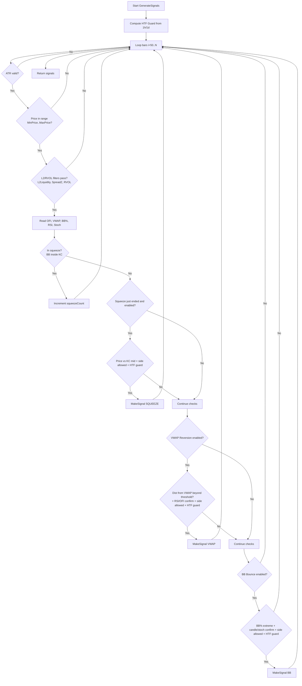
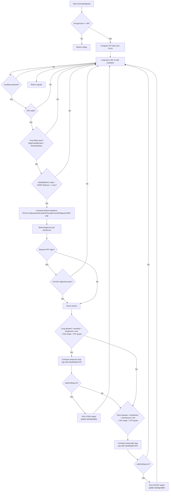

# Strategy Flowcharts: V3, V6, V9

This document visualizes the current C# strategy execution flow for:
- `StrategyV3` (VWAP Reversion + BB + Keltner)
- `StrategyV6` (Opening Range Breakout)
- `StrategyV9` (L1/L2 score-based)

## V3 Flow (`StrategyV3`)



## V6 Flow (`StrategyV6`)

```mermaid
flowchart TD
    A[Start GenerateSignals] --> B[Compute HTF bias]
    B --> C[Group bars by trading day]
    C --> D[For each day: compute Opening Range OR]
    D --> E{OR valid and OR range in ATR bounds?}
    E -- No --> D
    E -- Yes --> F[Init day counters longEntries/shortEntries]
    F --> G[Loop intraday bars from OR end]

    G --> H{ATR valid?}
    H -- No --> G
    H -- Yes --> I{Inside configured entry window?}
    I -- No --> G
    I -- Yes --> J{20MA distance <= MaxMaDistAtr?}
    J -- No --> G
    J -- Yes --> K{RVOL filter pass?}
    K -- No --> G
    K -- Yes --> L[Evaluate breakout/breakdown]

    L --> M{LONG break condition met?\n(cross/inside rule + OR high)}
    M -- Yes --> N{HTF allows long?\n(or IgnoreHtfBias)}
    N -- Yes --> O{VWAP align required and pass?}
    O -- Yes --> P[Build LONG signal\n(stop from OR/opposite/midpoint)]
    O -- No --> G
    N -- No --> G
    P --> G
    M -- No --> Q

    Q{SHORT break condition met?\n(cross/inside rule + OR low)} --> R{HTF allows short?\n(or IgnoreHtfBias)}
    R -- Yes --> S{VWAP align required and pass?}
    S -- Yes --> T[Build SHORT signal\n(stop from OR/opposite/midpoint)]
    S -- No --> G
    R -- No --> G
    T --> G

    G --> U[Return signals]
```

## V9 Flow (`StrategyV9`)



## Exit Simulation (all three)

All three strategies delegate trade simulation to `ExitEngine.SimulateTrade(...)` with strategy-specific exit configuration.
